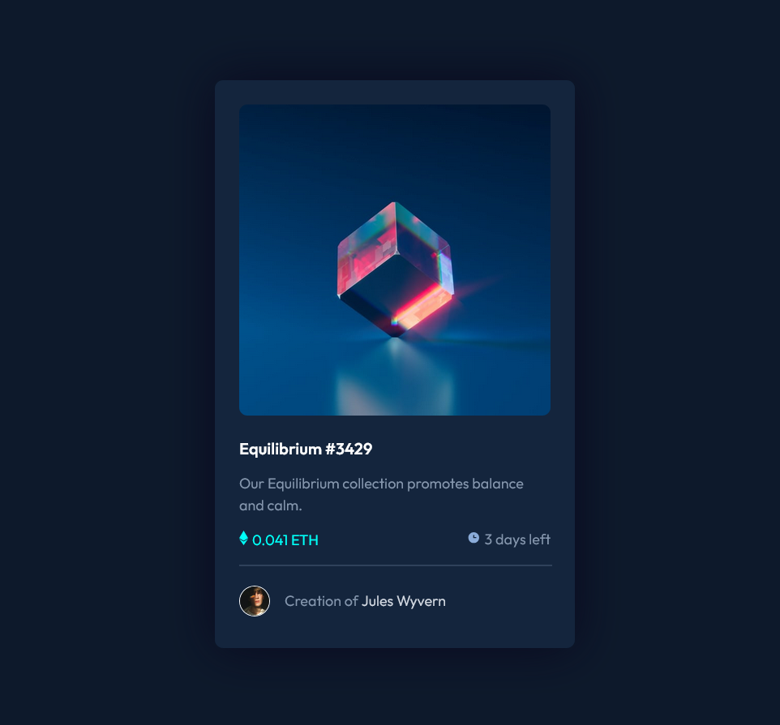

# Frontend Mentor - NFT preview card component solution

This is a solution to the [NFT preview card component challenge on Frontend Mentor](https://www.frontendmentor.io/challenges/nft-preview-card-component-SbdUL_w0U). 

## Table of contents

- [Overview](#overview)
  - [The challenge](#the-challenge)
  - [Screenshot](#screenshot)
  - [Links](#links)
- [My process](#my-process)
  - [Built with](#built-with)
  - [What I learned](#what-i-learned)
  - [Continued development](#continued-development)
  - [Useful resources](#useful-resources)
- [Author](#author)

## Overview

### The challenge

Users should be able to:

- View the optimal layout depending on their device's screen size
- See hover states for interactive elements

### Screenshot



### Links

- Solution/Live Site URL: [Add solution URL here](https://blessyoumate.github.io/nft-card-fm/)

## My process

### Built with

- Semantic HTML5 markup
- CSS custom properties
- Flexbox
- Mobile-first workflow

### What I learned

This was my first Frontend Mentor challenge, so I picked something simple to start with. During this project, I practiced and recapped basic HTML and CSS.

What I Learned

For the first time, I implemented an overlay on an image with an icon. I used some helpful resources online, like W3Schools – Image Overlay (https://www.w3schools.com/howto/howto_css_image_overlay_icon.asp)

One challenge I faced was controlling the opacity of the icon. Initially, I set the opacity of the overlay parent to 0.4, but I realized that you cannot simply set opacity: 1 on the child element to make it fully visible.

The solution was to:

Use alpha channel for the background color instead of changing parent opacity.

Keep the overlay’s opacity at 0 (hidden) and 1 (visible) on hover/focus.


```html
<button class="overlay" aria-label="View NFT details">
  
</button>
```
```css

:root{
  ...
  --cyan-400-transparent: hsla(178, 100%, 50%, 0.4);
  ...
}

.overlay{
    border-radius: 10px;
    position: absolute;
    top: 0;
    bottom: 0;
    left: 0;
    right: 0;
    height: 100%;
    width: 100%;
    opacity: 0;
    transition: .7s ease;
    background-color: var(--cyan-400-transparent);

    display: flex;
    align-items: center;
    justify-content: center;
}

.overlay-img{
    width: 4vw;
}

.img-container:hover .overlay,
.img-container:focus-within .overlay{
    opacity: 1;
    cursor: pointer;
}
```

### Continued development

Now I plan to complete 2–3 more easy challenges to practice and build confidence. After that, I will move on to more advanced challenges.

### Useful resources

- [W3Schools – Image Overlay](https://www.w3schools.com/howto/howto_css_image_overlay_icon.asp) - This helped me with overlay on image.

## Author

- Website - [Wiktor Jasiak](https://github.com/BlessYouMate)
- Frontend Mentor - [@BlessYouMate](https://www.frontendmentor.io/profile/BlessYouMate)
